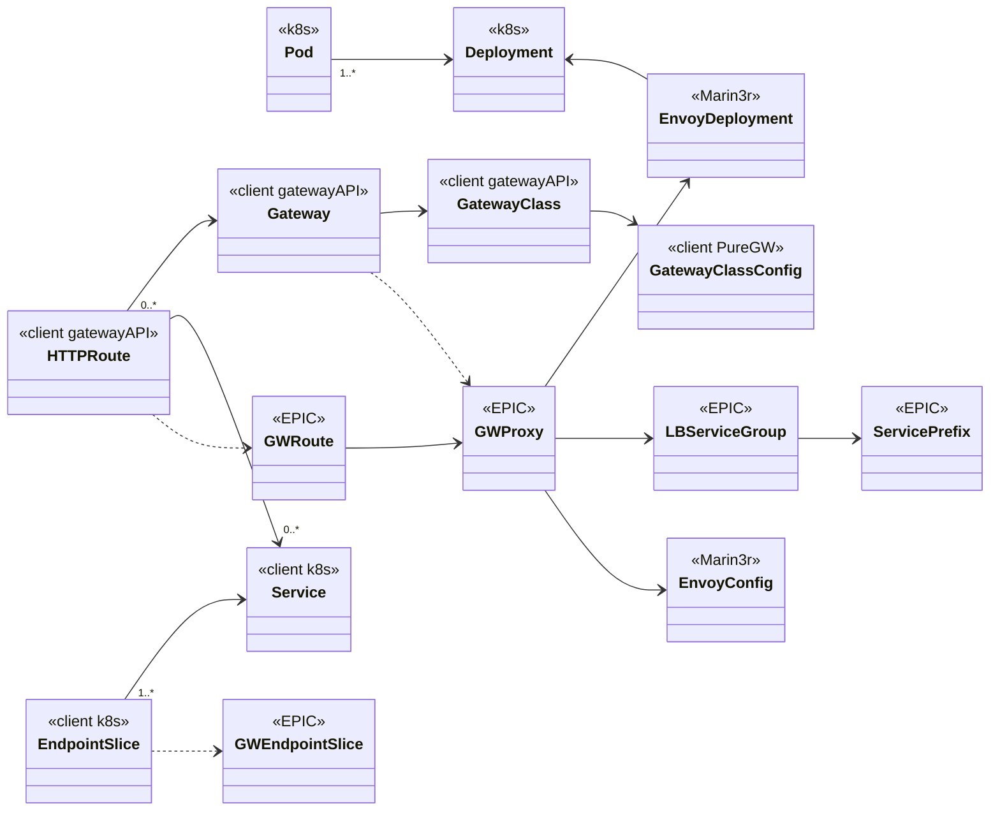

Data Model
==========

Server
------

```mermaid
classDiagram
   direction LR

   class EnvoyConfig{
      <<Marin3r>>
   }
   class Deployment{
      <<k8s>>
   }
   class Pod{
      <<k8s>>
   }
   class EnvoyDeployment{
      <<Marin3r>>
   }
   class ServicePrefix{
      <<EPIC>>
   }
   class LBServiceGroup{
      <<EPIC>>
   }
   class GWProxy{
      <<EPIC>>
   }
   class GWRoute{
      <<EPIC>>
   }
   class GWEndpointSlice{
      <<EPIC>>
   }

   GWRoute --> GWProxy
   GWProxy --> EnvoyDeployment
   GWProxy --> LBServiceGroup
   LBServiceGroup --> ServicePrefix
   GWProxy --> EnvoyConfig
   Deployment <-- EnvoyDeployment
   Pod "1..*" --> Deployment

   class GatewayClassConfig{
      <<client PureGW>>
   }
   class GatewayClass{
      <<client gatewayAPI>>
   }
   class Gateway{
      <<client gatewayAPI>>
   }
   class HTTPRoute{
      <<client gatewayAPI>>
   }
   class Service{
      <<client k8s>>
   }
   class EndpointSlice{
      <<client k8s>>
   }

   GatewayClass --> GatewayClassConfig
   Gateway --> GatewayClass
   Gateway ..> GWProxy
   HTTPRoute "0..*" --> Gateway
   HTTPRoute --> "0..*" Service
   HTTPRoute ..> GWRoute
   EndpointSlice "1..*" --> Service
   EndpointSlice ..> GWEndpointSlice
```
